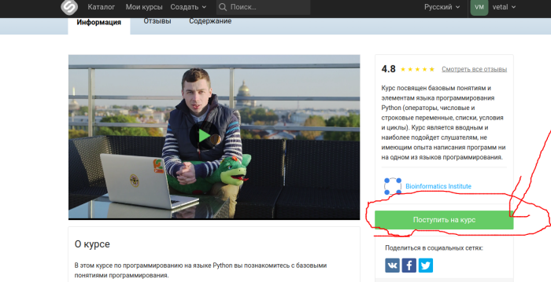
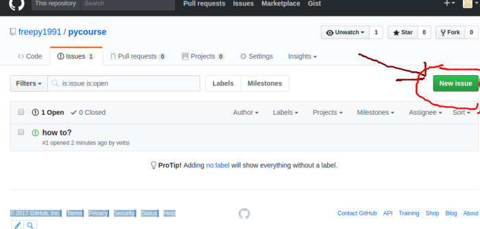

Для занятий Вам необходимо:

1. Зарегистрировать учетную запись на платформе <a href="http://stepik.org">http://stepik.org</a>

2. Присоединится к электронному курсу https://stepik.org/course/Программирование-на-Python-67/ путем нажатия кнопки "Поступить на курс"

3. Просмотреть материал в разделах 1.1, 1.2, 1.5, 1.6 и по-возможности сделать упражнения к этим разделам. Пункты 1.3, 1.4 являются опциональными и для занятий врядли понадобятся. Для Выполнения вычислений можно использовать платформу <a href="https://repl.it/languages/python3"> https://repl.it/languages/python3</a>, где можно запускать исходную программу и смотреть результаты или же сервис описанный в разделе 1.3

4. Зарегистрируйтесь на сервисе <a href="https://github.com/">https://github.com/</a> и перейдя на <a href="https://github.com/freepy1991/pycourse/issues">форум</a>  создайте сообщение на форуме чтобы убедится что у вас все получилось с помощью ссылки "new issue"

5. Если возникли вопросы или проблемы при выполнении какого-то из пунктов - пишите на почту xtfkpi@gmail.com
